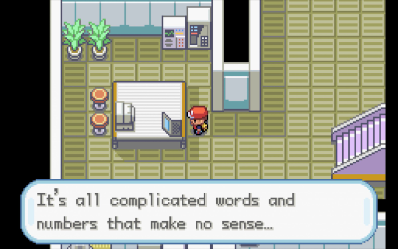

<p align="center">
  
</p>

# Kaixo there 👋


```python
#!/usr/bin/python
# -*- coding: utf-8 -*-

import time

class BioinformaticsScientist:

    def __init__(self):
        self.name = "Irantzu"
        self.role = "Bioinformatics Scientist"
        self.location = "Oslo, Norway"
        self.rl_languages = ["spanish", "english", "basque"]

    @staticmethod
    def siesta():
        print("...zzz...")
        time.sleep(10000)

    def say_hi(self):
        print("Hi! I still need to improve this README. Mañana, mañana...")
        self.siesta()

me = BioinformaticsScientist()
me.say_hi()
```

## 👩‍💻 Technologies & Tools

**Programming Languages:**


**Workflow orchestrators:**


**Tools and Services:**


## 🧬 Bioinformatics

```python
me.siesta()
```

## 📝 Publications

```python
me.siesta()
```

<br>
 
<p align="center">
  <i>Let's connect! Find me on...</i>
   
<p align="center">

<a href="https://www.linkedin.com/in/irantzuanzar/">
  <code></code>
</a>
<a href="mailto:iranmdl15@gmail.com">
<code></code>
</a>

  <p align="center">
    <i>Agur!</i>
</p>

<div align="right">
    

</div>


